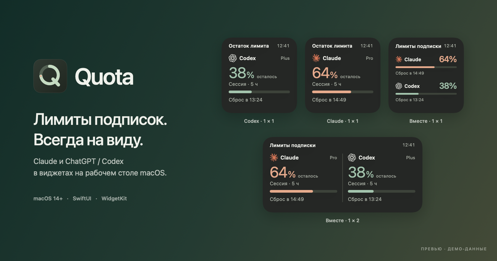
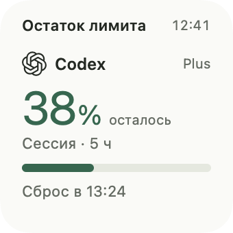
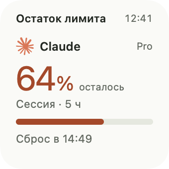
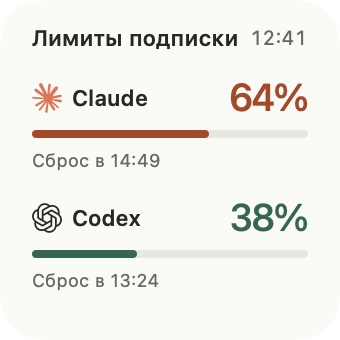
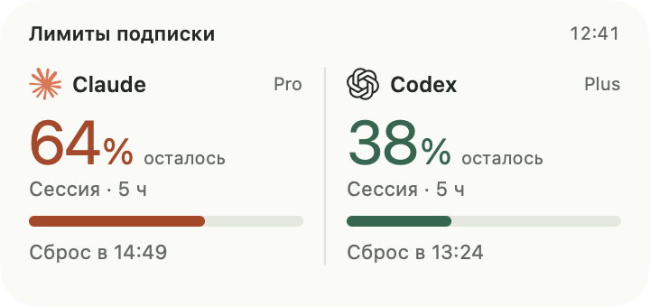
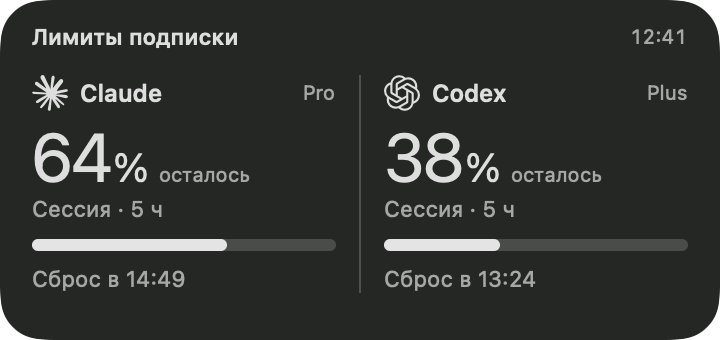
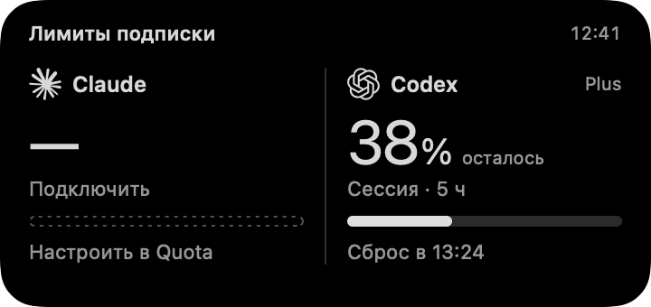
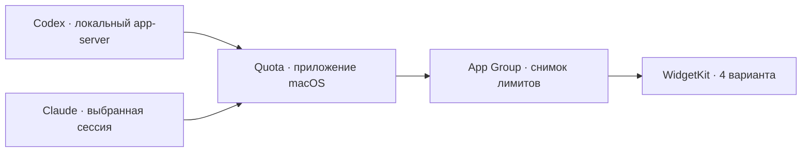

<p align="center">
  <picture>
    <source media="(prefers-color-scheme: dark)" srcset="docs/images/readme-hero-dark.png">
    <source media="(prefers-color-scheme: light)" srcset="docs/images/readme-hero-light.png">
    
  </picture>
</p>

<h1 align="center">Quota</h1>
<p align="center"><strong>Лимиты подписок Claude и ChatGPT / Codex — прямо на рабочем столе Mac.</strong></p>
<p align="center">
  <code>macOS 14+</code> &nbsp; <code>SwiftUI</code> &nbsp; <code>WidgetKit</code> &nbsp; <code>Apple Silicon + Intel</code>
</p>
<p align="center">
  <a href="#виджеты">Виджеты</a> ·
  <a href="#подключение">Подключение</a> ·
  <a href="#сборка">Сборка</a> ·
  <a href="#запуск-через-прокси">Прокси</a>
</p>

Quota показывает, сколько осталось от лимита подписки и когда он восстановится. Подключается к установленным приложениям, обновляет данные в фоне и передаёт их системным виджетам macOS.

**Четыре виджета. Две подписки. Один взгляд на рабочий стол.**

## Виджеты

<table>
  <tr>
    <th align="center">ChatGPT / Codex · 1×1</th>
    <th align="center">Claude · 1×1</th>
    <th align="center">Вместе · 1×1</th>
  </tr>
  <tr>
    <td align="center"><picture><source media="(prefers-color-scheme: dark)" srcset="docs/images/openai-dark.png"></picture></td>
    <td align="center"><picture><source media="(prefers-color-scheme: dark)" srcset="docs/images/claude-dark.png"></picture></td>
    <td align="center"><picture><source media="(prefers-color-scheme: dark)" srcset="docs/images/combined-small-dark.png"></picture></td>
  </tr>
  <tr>
    <td align="center">Лимиты Codex в подписке ChatGPT</td>
    <td align="center">Лимиты выбранного аккаунта Claude</td>
    <td align="center">Оба подключения в одном квадрате</td>
  </tr>
</table>

<p align="center">
  <strong>Вместе · 1×2</strong><br><br>
  <picture>
    <source media="(prefers-color-scheme: dark)" srcset="docs/images/combined-dark.png">
    
  </picture>
</p>
<p align="center"><sub>Рендеры настоящих SwiftUI-компонентов. Все показанные значения — демонстрационные.</sub></p>

- **Остаток и сброс.** Процент, шкала, выбранное окно лимита и время восстановления.
- **Системное оформление.** Светлая и тёмная темы, контрастная шкала в монохромном режиме.
- **Честные состояния.** Отсутствие данных не превращается в 0% или 100%; устаревшие значения помечаются.
- **Обновление без повторного добавления.** Новая сборка регистрирует своё расширение и обновляет виджеты, сохраняя прежние идентификаторы.
- **Только WidgetKit.** Плавающих окон, имитирующих виджеты, нет.

<details>
<summary><strong>Монохром и отсутствие данных</strong></summary>
<br>
<p align="center">
  
  
</p>

Шкалы различаются прозрачностью, поэтому сохраняют читаемость, когда macOS приводит виджет к одному цвету. После ожидаемого сброса Quota показывает «Проверяем сброс» до получения свежих данных.

</details>

## Что умеет приложение

| Возможность | Как работает |
| --- | --- |
| Лимиты подписки | Окна, проценты использования и время сброса, которые возвращает сервис |
| Расходы и кредиты | Доступные денежные сведения Claude и кредиты Codex — если источник их предоставляет |
| Активность Codex | Дневная статистика и сводные показатели в основном окне |
| Обновление в фоне | Каждые 5 минут и после пробуждения, пока Quota запущена |
| Автозапуск | Включается в настройках приложения |
| Поддержка прокси | Отдельные профили и локальные туннели оболочек ATLAS |

Лимиты Codex не означают лимиты всех моделей обычного чата ChatGPT. История банковских списаний и цена тарифа не гарантируются источниками; токены не пересчитываются в деньги. Новые виджеты активности пока находятся на стадии дизайн-концепций.

## Подключение

### ChatGPT / Codex

Установите официальный клиент Codex и войдите через ChatGPT. Quota использует его существующий сеанс через локальный app-server. Если входа ещё нет, нажмите **«Войти через ChatGPT»** в Quota и завершите авторизацию в браузере.

### Claude

- **Claude Desktop:** Quota обнаруживает профиль автоматически. Если macOS требует разрешение, нажмите **«Сеанс Claude Desktop»** и разрешите чтение `Claude Safe Storage` в Связке ключей.
- **Claude Code:** нажмите **«Сеанс Claude Code»**, если уже вошли в терминальном клиенте.
- **Веб-вход:** нажмите **«Войти в Claude»**, завершите вход и выберите **«Подключить»**.

При нескольких профилях или организациях выберите нужный аккаунт в основном окне.

### Запуск через прокси

Поддерживаются оболочки **ATLAS ChatGPT Proxy / Claude Proxy**. Здесь ATLAS — название сторонних скриптов запуска, **не браузер ChatGPT Atlas и не отдельный тип аккаунта**.

Сначала запустите нужный ярлык прокси, затем Quota. Профили и локальные порты определяются автоматически. Оставляйте туннель работающим: Quota не запускает менеджер прокси самостоятельно и не переключается на прямую сеть при отказе выбранного relay.

[Технические подробности подключения →](docs/TECHNICAL.md)

## Сборка

Нужны **полный Xcode**, компоненты macOS SDK и сертификат **Apple Development** для подписанного приложения с системными виджетами. Зависимостей от сторонних пакетов нет.

1. В Xcode откройте **Settings → Accounts**, добавьте Apple Account и создайте сертификат в **Manage Certificates**.
2. В корне проекта выполните:

   ```bash
   cp Config/Signing.example.xcconfig Config/Signing.local.xcconfig
   ```

3. Укажите свой Team ID вместо `YOURTEAMID` в `Config/Signing.local.xcconfig`. Файл применяется к приложению и расширению и исключён из Git. Для локальной установки на Mac используется Apple Development; платная публикация в App Store для такой сборки не нужна.
4. Откройте проект и запустите схему **Quota → My Mac**:

   ```bash
   open Quota.xcodeproj
   ```

Для запуска нажмите **⌘R**. Для релиза выберите **Product → Archive** или выполните из корня проекта:

```bash
swift test
xcodebuild -project Quota.xcodeproj -scheme Quota \
  -configuration Release -destination 'platform=macOS' \
  -derivedDataPath .xcode-build \
  -archivePath Build/Quota.xcarchive archive
```

Приложение появится в `Build/Quota.xcarchive/Products/Applications/Quota.app`, вместе с системным расширением виджетов. Скрипты для сборки не требуются. Вспомогательная папка `scripts/` хранится только локально и исключена из Git.

Приложение и WidgetKit extension используют одну группу `$(DEVELOPMENT_TEAM).local.quota.widgets`. Настройки общего контейнера находятся в `Config/Xcode` и входят в репозиторий.

Перед выпуском обновления увеличьте `CFBundleVersion` одинаково в `Config/Xcode/Quota-Info.plist` и `Config/Xcode/Widget-Info.plist`; те же значения сохраните в исходных `Config/Quota-Info.plist` и `Config/Widget-Info.plist`. Это позволяет macOS распознать новую сборку виджетов.

## Установка виджетов

1. Завершите предыдущую Quota и перенесите новую `Quota.app` в **Applications / Программы**.
2. Запустите её и дождитесь загрузки лимитов.
3. Правый клик по рабочему столу → **Изменить виджеты → Quota**.
4. Выберите любой из четырёх вариантов. Для обновления данных оставляйте Quota запущенной; основное окно можно закрыть.

macOS самостоятельно определяет частоту перерисовки WidgetKit. После обновления снимка Quota запрашивает обновление всех своих виджетов.

## Как это устроено



Сессии обрабатывает основное приложение. Расширение получает минимальный снимок лимитов без email, ключей авторизации, денежных подробностей и истории активности. Claude Desktop читается без изменения исходного профиля; запросы Keychain не появляются в фоне.

```text
Quota.xcodeproj          приложение и системное расширение
Sources/
  QuotaCore/            модели, парсеры, профили, хранение
  QuotaUI/              компоненты виджетов, логотипы, палитра
  QuotaApp/             интерфейс, подключения, обновления
  QuotaRender/          рендеры с демо-данными и проверки шкал
Widgets/                три WidgetKit kind, четыре варианта
Tests/                  проверки данных и подключений
Config/                 plist, entitlements, настройка подписи
docs/images/            изображения для README
```

## Проверки и документация

```bash
# Тесты на синтетических данных и localhost
swift test

# Только по явному желанию: действующий аккаунт этого Mac
QUOTA_RUN_LIVE_TEST=1 swift test --filter ConnectionTests.testLiveCodexWhenExplicitlyRequested

# Получить новые рендеры из SwiftUI-компонентов
swift run -c release QuotaRender work/readme-render
```

Обычный прогон не обращается к реальному аккаунту: соответствующий тест пропускается. Тестовые ключи и cookie синтетические; реальные сессии не включаются в репозиторий.

- [Технические подробности и хранение данных](docs/TECHNICAL.md)
- [Источники логотипов](Assets/Brand/SOURCES.md)

## Лицензия

[GNU AGPL v3](LICENSE). Логотипы Claude и OpenAI принадлежат соответствующим правообладателям и используются для обозначения подключений. Quota — независимый проект, не официальный продукт Anthropic или OpenAI.
